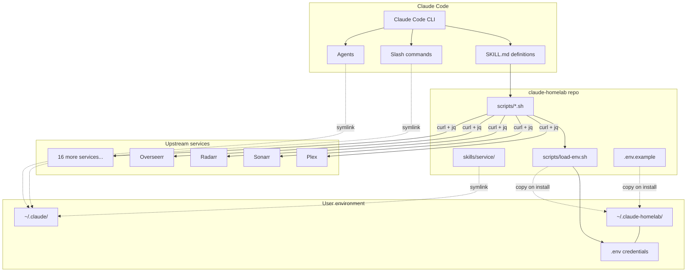

# Architecture Overview — claude-homelab

Architecture patterns for the claude-homelab skill collection and plugin system.

## System overview

claude-homelab provides a dual-install system that connects Claude Code to self-hosted homelab services. Skills are Bash scripts that call upstream REST APIs via `curl` and return structured JSON output.



## Dual-install system

claude-homelab supports two installation paths:

| Path | Mechanism | Discovery |
| --- | --- | --- |
| Plugin marketplace | `/plugin marketplace add jmagar/claude-homelab` | Claude Code plugin cache at `~/.claude/plugins/cache/` |
| Bash installer | `curl -sSL .../install.sh \| bash` | Symlinks into `~/.claude/` directories |

Both paths result in the same outcome: Claude Code discovers skills, commands, and agents.

## Request flow

```
User prompt
    |
    v
Claude Code CLI
    |
    v
SKILL.md (skill definition with commands and examples)
    |
    v
scripts/*.sh (Bash script execution)
    |
    v
load-env.sh (credential loading from ~/.claude-homelab/.env)
    |
    v
curl (HTTP request to upstream service API)
    |
    v
jq (JSON response parsing and formatting)
    |
    v
Structured output returned to Claude Code
```

## Symlink architecture (Bash install path)

The Bash installer creates symlinks from the repo into `~/.claude/` for Claude Code discovery:

```
~/.claude/
├── agents/
│   └── notebooklm-specialist.md → ~/claude-homelab/agents/notebooklm-specialist.md
├── skills/
│   ├── plex/                    → ~/claude-homelab/skills/plex/
│   ├── radarr/                  → ~/claude-homelab/skills/radarr/
│   ├── sonarr/                  → ~/claude-homelab/skills/sonarr/
│   └── ... (18 skill directories)
└── commands/
    ├── check.md                 → ~/claude-homelab/commands/check.md
    ├── deploy.md                → ~/claude-homelab/commands/deploy.md
    ├── quick-push.md            → ~/claude-homelab/commands/quick-push.md
    ├── homelab/                 → ~/claude-homelab/commands/homelab/
    └── notebooklm/              → ~/claude-homelab/commands/notebooklm/

~/.claude-homelab/
├── .env                         # Credentials (chmod 600)
└── load-env.sh                  # Copied from scripts/load-env.sh
```

The source of truth is always the repo. Never edit files in `~/.claude/` directly.

## Credential flow

```
.env.example (template, tracked in git, no secrets)
    |
    v  (copied on install)
~/.claude-homelab/.env (real credentials, chmod 600, gitignored)
    |
    v  (sourced at runtime)
load-env.sh → load_env_file()
    |
    v  (validated)
load-env.sh → validate_env_vars("SERVICE_URL", "SERVICE_API_KEY")
    |
    v  (available as shell variables)
scripts/*.sh → curl -H "X-Api-Key: $SERVICE_API_KEY" "$SERVICE_URL/api/..."
```

Environment variable naming conventions:

| Pattern | Example | When |
| --- | --- | --- |
| `SERVICE_URL` + `SERVICE_API_KEY` | `PLEX_URL`, `PLEX_TOKEN` | Single-instance services |
| `SERVICE1_URL` + `SERVICE1_API_KEY` | `SONARR1_URL`, `SONARR1_API_KEY` | Multi-instance services |

## Marketplace architecture

The `.claude-plugin/marketplace.json` catalog contains 27 plugin entries:

| Type | Count | Source | Example |
| --- | --- | --- | --- |
| Core plugin | 1 | `"./"` (repo root) | homelab-core |
| Bundled skills | 16 | `"./skills/name"` | plex, radarr, sonarr |
| External repos | 10 | `{ "source": "github", "repo": "..." }` | overseerr-mcp, synapse-mcp |

Bundled skills graduate to external repos when they gain additional plugin surface area (agents, commands, MCP servers). Until then, they remain bundled with homelab-core.

## Skill directory structure

Every skill follows the same layout:

```
skills/service-name/
├── SKILL.md            # Claude-facing skill definition
├── scripts/
│   ├── search.sh       # API operations
│   ├── status.sh       # Health/status check
│   └── manage.sh       # CRUD operations
└── references/
    ├── api-endpoints.md      # REST API documentation
    ├── quick-reference.md    # Quick examples
    └── troubleshooting.md    # Common issues
```

## Command architecture

Slash commands are `.md` files that Claude Code discovers automatically:

| File location | Command name |
| --- | --- |
| `commands/check.md` | `/check` |
| `commands/homelab/docker-health.md` | `/homelab:docker-health` |
| `commands/notebooklm/create.md` | `/notebooklm:create` |

The directory name becomes the namespace prefix. The file name becomes the command after the colon.

Prompt bodies are stored separately in `prompts/` as `.toml` files, mirroring the `commands/` structure.

## Error handling pattern

All scripts follow defensive error handling:

```bash
# Timeout protection on every API call
if ! response=$(timeout 30 curl -sf \
    -H "X-Api-Key: $SERVICE_API_KEY" \
    "$SERVICE_URL/api/v1/endpoint" 2>&1); then
    echo '{"success": false, "error": "Request failed or timed out"}' | jq .
    exit 1
fi

# Validate JSON before processing
if ! echo "$response" | jq empty 2>/dev/null; then
    echo '{"success": false, "error": "Invalid JSON response"}' | jq .
    exit 1
fi
```

## Relationship with external MCP servers

The 10 external MCP server repos are separate applications that run as long-lived processes with their own transport layers. They are referenced in the marketplace catalog but are architecturally independent:

```
claude-homelab (this repo)          External MCP repos
─────────────────────────           ──────────────────
Bash scripts                        Python/TS/Rust servers
Run on demand                       Long-lived processes
curl → upstream API                 MCP protocol → upstream API
No transport layer                  stdio / HTTP+SSE / streamable-http
Credentials via .env                Credentials via .env or env vars
```

## Cross-references

- [TECH](TECH.md) — technology choices
- [PRE-REQS](PRE-REQS.md) — prerequisites for development and usage
